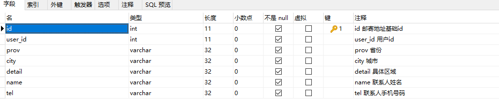
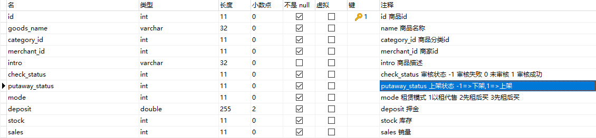
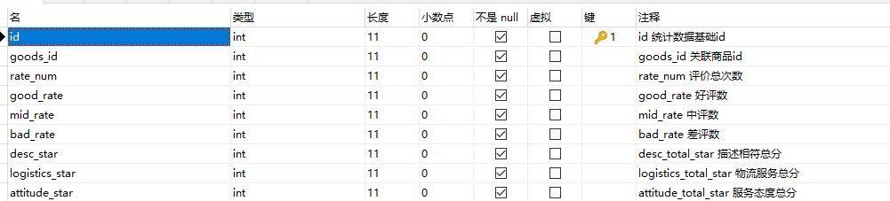
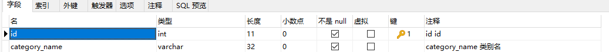
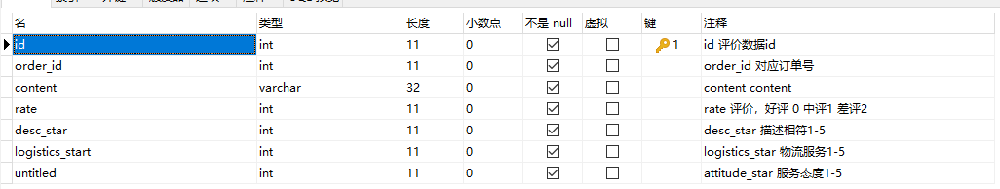

### 用户信息表


```sql
CREATE TABLE user(
    id INT NOT NULL AUTO_INCREMENT  COMMENT 'id 用户id号' ,
    account VARCHAR(32)    COMMENT 'account 用户账号' ,
    password VARCHAR(32) NOT NULL   COMMENT 'password 用户密码' ,
    username VARCHAR(32) NOT NULL   COMMENT 'username 用户昵称' ,
    tel VARCHAR(32)    COMMENT 'tel 用户手机号码' ,
    email VARCHAR(32)    COMMENT 'email 用户邮箱' ,
    balance DECIMAL(32,10) NOT NULL  DEFAULT 0.0 COMMENT 'balance 用户余额' ,
    PRIMARY KEY (id)
) COMMENT = 'user 用户信息表';
```


### 用户地址表



```sql
CREATE TABLE user_address(
    id INT NOT NULL AUTO_INCREMENT  COMMENT 'id 邮寄地址基础id' ,
    user_id INT NOT NULL   COMMENT 'user_id 用户id' ,
    prov VARCHAR(32) NOT NULL   COMMENT 'prov 省份' ,
    city VARCHAR(32) NOT NULL   COMMENT 'city 城市' ,
    detail VARCHAR(32) NOT NULL   COMMENT 'detail 具体区域' ,
    name VARCHAR(32) NOT NULL   COMMENT 'name 联系人姓名' ,
    tel VARCHAR(32) NOT NULL   COMMENT 'tel 联系人手机号码' ,
    PRIMARY KEY (id)
) COMMENT = 'user_address 用户地址表';
```


### 用户购物车表


```sql
CREATE TABLE goods(
    id INT NOT NULL AUTO_INCREMENT  COMMENT 'id 商品id' ,
    goods_name VARCHAR(32) NOT NULL   COMMENT 'name 商品名称' ,
    category_id INT NOT NULL   COMMENT 'category_id 商品分类id' ,
    merchant_id INT NOT NULL   COMMENT 'merchant_id 商家id' ,
    intro VARCHAR(32)    COMMENT 'intro 商品描述' ,
    check_status INT NOT NULL   COMMENT 'check_status 审核状态 -1 审核失败 0 未审核 1 审核成功' ,
    putaway_status INT NOT NULL   COMMENT 'putaway_status 上架状态 -1=>下架,1=>上架' ,
    mode INT NOT NULL   COMMENT 'mode 租赁模式 1以租代售 2先租后买 3先租后买' ,
    deposit DECIMAL(32,10) NOT NULL   COMMENT 'deposit 押金' ,
    stock INT NOT NULL  DEFAULT 0 COMMENT 'stock 库存' ,
    sales INT NOT NULL  DEFAULT 0 COMMENT 'sales 销量' ,
    PRIMARY KEY (id)
) COMMENT = 'goods 商品表';
```


### 商品表



```sql
CREATE TABLE goods(
    id INT NOT NULL AUTO_INCREMENT  COMMENT 'id 商品id' ,
    goods_name VARCHAR(32) NOT NULL   COMMENT 'name 商品名称' ,
    category_id INT NOT NULL   COMMENT 'category_id 商品分类id' ,
    merchant_id INT NOT NULL   COMMENT 'merchant_id 商家id' ,
    intro VARCHAR(32)    COMMENT 'intro 商品描述' ,
    check_status INT NOT NULL   COMMENT 'check_status 审核状态 -1 审核失败 0 未审核 1 审核成功' ,
    putaway_status INT NOT NULL   COMMENT 'putaway_status 上架状态 -1=>下架,1=>上架' ,
    mode INT NOT NULL   COMMENT 'mode 租赁模式 1以租代售 2先租后买 3先租后买' ,
    deposit DECIMAL(32,10) NOT NULL   COMMENT 'deposit 押金' ,
    stock INT NOT NULL  DEFAULT 0 COMMENT 'stock 库存' ,
    sales INT NOT NULL  DEFAULT 0 COMMENT 'sales 销量' ,
    PRIMARY KEY (id)
) COMMENT = 'goods 商品表';

```


### 商品统计情况表



```sql
CREATE TABLE goods_statistics(
    id INT NOT NULL AUTO_INCREMENT  COMMENT 'id 统计数据基础id' ,
    goods_id INT NOT NULL   COMMENT 'goods_id 关联商品id' ,
    goods_id INT NOT NULL  DEFAULT 0 COMMENT 'rate_num 评价总次数' ,
    good_rate INT NOT NULL  DEFAULT 0 COMMENT 'good_rate 好评数' ,
    mid_rate INT NOT NULL  DEFAULT 0 COMMENT 'mid_rate 中评数' ,
    bad_rate INT NOT NULL  DEFAULT 0 COMMENT 'bad_rate 差评数' ,
    desc_star INT NOT NULL  DEFAULT 0 COMMENT 'desc_total_star 描述相符总分' ,
    logistics_star INT NOT NULL   COMMENT 'logistics_total_star 物流服务总分' ,
    attitude_star INT NOT NULL   COMMENT 'attitude_total_star 服务态度总分' ,
    PRIMARY KEY (id)
) COMMENT = 'goods_statistics 商品统计情况表';
```


### 管理员表


```sql
CREATE TABLE admin(
    id INT NOT NULL   COMMENT 'id id' ,
    account VARCHAR(32) NOT NULL   COMMENT 'account 账户名' ,
    password VARCHAR(32) NOT NULL   COMMENT 'password 管理员密码' ,
    PRIMARY KEY (id)
) COMMENT = 'admin 管理员表';
```


### 商家表


```sql
CREATE TABLE merchant(
    id INT NOT NULL AUTO_INCREMENT  COMMENT 'id 商家id' ,
    account VARCHAR(32) NOT NULL   COMMENT 'account 商家账号' ,
    password VARCHAR(32) NOT NULL   COMMENT 'password 商家密码' ,
    merchant_name VARCHAR(32) NOT NULL   COMMENT 'merchant_name 商家名称' ,
    balance VARCHAR(32) NOT NULL   COMMENT 'balance 商家账户余额' ,
    tel VARCHAR(32) NOT NULL   COMMENT 'tel 商家手机号码' ,
    PRIMARY KEY (id)
) COMMENT = 'merchant 商家表';
```


### 商家地址表


```sql
CREATE TABLE merchant_address(
    id INT NOT NULL AUTO_INCREMENT  COMMENT 'id 邮寄地址基础id' ,
    user_id INT NOT NULL   COMMENT 'merchant_id 商家id' ,
    prov VARCHAR(32) NOT NULL   COMMENT 'prov 省份' ,
    city VARCHAR(32) NOT NULL   COMMENT 'city 城市' ,
    detail VARCHAR(32) NOT NULL   COMMENT 'detail 具体区域' ,
    name VARCHAR(32) NOT NULL   COMMENT 'name 联系人姓名' ,
    tel VARCHAR(32) NOT NULL   COMMENT 'tel 联系人手机号码' ,
    PRIMARY KEY (id)
) COMMENT = 'merchant_address 商家地址表';
```


### 类别表



```sql
CREATE TABLE category(
    id INT NOT NULL AUTO_INCREMENT  COMMENT 'id id' ,
    category_name VARCHAR(32) NOT NULL   COMMENT 'category_name 类别名' ,
    PRIMARY KEY (id)
) COMMENT = 'category 类表';
```


### 订单评论统计表



```sql
CREATE TABLE comment_statistic(
    id INT NOT NULL AUTO_INCREMENT  COMMENT 'id 评价数据id' ,
    order_id INT NOT NULL   COMMENT 'order_id 对应订单号' ,
    content VARCHAR(32) NOT NULL   COMMENT 'content content' ,
    rate INT NOT NULL   COMMENT 'rate 评价，好评 0 中评1 差评2' ,
    desc_star INT NOT NULL   COMMENT 'desc_star 描述相符1-5' ,
    logistics_start INT NOT NULL   COMMENT 'logistics_star 物流服务1-5' ,
    untitled INT NOT NULL   COMMENT 'attitude_star 服务态度1-5' ,
    PRIMARY KEY (id)
) COMMENT = 'comment_statistic 订单评论统计表';
```


### 售后情况表